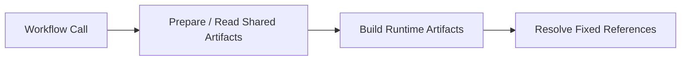

# Reusable Workflow Contracts

Use this when editing shared workflows under `.github/workflows/shared_*.yml` or the workflow contracts they expose.

## Release And Validation

`release.yml` creates release tags, prepares shared CI artifacts, builds release outputs, and publishes GitHub releases.

- Version bumps come from `chrispsheehan/get-release-version`, which scans commit subjects since the latest semver tag.
- Configurable bump prefixes classify major, minor, and patch releases.
- `createNewTag` is the tag-creation predicate.
- `createNewRelease` is the full-release predicate.
- `release_bumps` is configured as `major,minor`.
- Patch bumps still create semver tags, but skip artifact discovery, shared artifact prep, runtime builds, commit-note collection, and GitHub release publishing.

`pull_request.yml` provides fast validation.

- Checks workflow syntax, Terraform formatting/linting, changed runtime builds, agent-wrapper sync, and direct execution of `chrispsheehan/get-release-version`.
- The agent-wrapper sync check verifies `AGENTS.md` and `CLAUDE.md` match the standard wrapper directing agents to `REPO_INSTRUCTIONS.md`.
- The version preview job classifies the PR title and shows the implied tag version, `createNewTag`, `createNewRelease`, and bump level.
- Its `check` job normally runs `.github/actions/get-changes` using the PR base SHA for a PR-style `base...HEAD` diff.
- Manual `workflow_dispatch` runs force every change flag on and rerun the full validation surface without a PR diff.
- When `.github/actions/**` changed, it reuses `shared_directories_get.yml` to discover action directories with `Dockerfile`s and runs a Docker unit-test matrix after GitHub formatting.
- Lambda source changes build the fixed `migrations` Lambda directly.
- ECS source changes build the fixed `worker` and `debug` images directly.
- Terragrunt installation uses `jdx/mise-action@v4`.
- TFLint setup uses the Node 24 `terraform-linters/setup-tflint@v6` line.

The version action is maintained outside this repository.

## Shared Artifact Prep And Build

`shared_infra_releases.yml` prepares or reads shared artifact infrastructure such as ECR and the code bucket.

- Exposes bucket/repository values as reusable-workflow outputs.
- The `ecr` job configures AWS credentials once.
- The Terraform ECR module owns the stable bootstrap `:bootstrap` image through the Docker provider, so the workflow does not perform a separate mirror/push step.
- The code-bucket job reads Lambda, AppSpec, and infra-plan S3 prefix names from string-returning `justfile.ci` recipes and forwards them as `TF_VAR_*`, so workflow YAML does not duplicate those key names inline.

`shared_build.yml` builds and publishes Lambda, and ECS artifacts.

- Lambda builds upload `lambdas/migrations` as `migrations.zip`.
- ECS image builds push `worker` and `debug` tags for the requested `ecs_version`.

`shared_build_get.yml` resolves artifact locations used by downstream deploy wrappers.

- Its multi-step `images` and `lambdas` jobs configure AWS credentials once.
- Repeated `just` calls reuse that ambient session against the same account.
- Prod deploy resolution checks `lambdas/<version>/migrations.zip` exists in the shared code bucket.
- Prod deploy resolution checks `worker-<version>` and `debug-<version>` exist in ECR.

## Shared Infra Wrappers

`shared_infra.yml` is the graph executor.

- Delegates graph and wave discovery to `shared_get_modules.yml`.
- Exposes `waves_json` as reusable-workflow output.
- Runs `wave_0` through `wave_3` jobs in dependency order.
- Each wave only runs when its module array is non-empty.
- Each wave fans modules out as a matrix, checks out the requested ref, configures AWS credentials once per matrix job, and invokes the repo-local Terragrunt action against `infra/live/<environment>/aws/<module>`.
- The deprecated `changed_items_json` workflow output remains for compatibility and currently mirrors `waves_json`.

Shared infra wrappers must forward permissions required by the nested reusable call chain:

- `id-token: write` everywhere the Terragrunt action may assume AWS OIDC
- `contents: read` for checkout

Shared plan/apply wrappers rely on AWS access to the shared code bucket rather than GitHub artifact permissions for cross-run recovery.

Current infra selection comes from the Terragrunt dependency graph and derived waves:

- shared infra wrappers no longer accept `lambda_matrix` or `service_matrix`
- shared infra wrappers no longer accept `code_bucket` or `bootstrap_image_uri`
- the current graph-wave placeholder path only needs `environment`, `infra_version`, and the Terragrunt action context
- shared infra plan/apply wrappers exclude `task_*` stacks from graph waves; code deploy owns task-definition revision registration and promotion
- shared infra plan/apply wrappers set `TF_VAR_bootstrap=true` so ECS service stacks can create the stable service surface before the first real task revision is deployed
- If a live environment is pruned to a smaller or differently shaped dependency closure, run `just tg-graph-waves <env>` and keep the static wave outputs/jobs aligned with the derived dependency depth for that environment.

## Code Deploy

`shared_deploy.yml` rolls out feature code.

- Its `Summary` job writes the fixed code deploy target summary.
- Publishes the `migrations` Lambda version.
- Invokes the `migrations` Lambda after CodeDeploy completes.
- Applies the `task_worker` stack with `worker` and `debug` image URIs.
- Updates the `service_worker` ECS service.
- Configures AWS credentials once at job start and lets local `just` and Terragrunt actions reuse that ambient session.
- Renders Lambda CodeDeploy AppSpec files from shared templates under `config/deploy/`.
- Mutating `just` steps should target `justfile.deploy` rather than the repo-root `justfile`.

## Ownership Boundary

- `*_infra` wrappers stop at infrastructure apply.
- `shared_deploy.yml` owns feature-code rollout.
- Prod wrappers read shared artifact resources from `ci` while applying deploy targets in `prod`.
- Do not add `shared_infra_releases.yml` to prod deploy wrappers unless the goal is explicitly deploy-time artifact creation.
