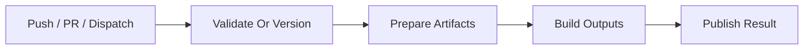
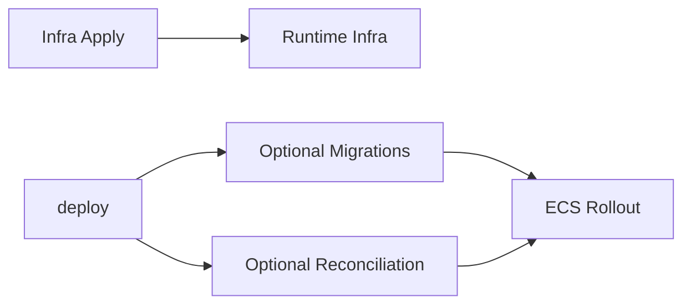

# Workflow Entry Points

Use this when deciding which workflow a user should trigger or when changing environment-specific wrapper behavior.

## Most-Used Workflows

| Workflow | Purpose |
| --- | --- |
| `dev_infra_apply_no_plan.yml` | Discovers directories, prepares dev artifacts, and applies dev infrastructure. It first prepares shared artifact infrastructure through `shared_infra_releases.yml`, then runs the shared infra apply wrapper with the target environment and infra ref. |
| `dev_infra_plan.yml` | Plans the ordered dev infra graph through `shared_infra_plan.yml`. |
| `dev_infra_plan_and_apply.yml` | Captures the current run as plan context, plans the ordered dev infra graph so metadata and per-stack plan artifacts are emitted, then reapplies the same graph through `shared_infra_apply_from_plan.yml`. |
| `dev_infra_apply_from_plan.yml` | Reapplies the ordered dev infra graph from plan artifacts created by an earlier dev plan run, using `plan_artifact_run_id` end to end. |
| `dev_code_deploy.yml` | Builds fresh dev artifacts, resolves deploy inputs, and deploys code to dev. |
| `prod_infra_plan.yml` | Resolves released artifacts from `ci`, then plans the ordered prod infra graph and emits metadata plus per-stack plan artifacts. |
| `prod_infra_apply_no_plan.yml` | Resolves released artifacts from `ci` and applies prod infrastructure. |
| `prod_infra_apply_from_plan.yml` | Reapplies the ordered prod infra graph from a prior `prod_infra_plan` run. The shared apply-from-plan wrapper reads metadata first, then each apply job downloads its matching per-stack artifact before invoking `apply_plan`. |
| `prod_code_deploy.yml` | Resolves released artifacts from `ci` and deploys code to prod. |

## Workflow Groups

- Release and validation: `release.yml`, `pull_request.yml`
- Shared artifact prep and build: `shared_infra_releases.yml`, `shared_build.yml`, `shared_build_get.yml`
- Shared infra and code rollout: `shared_infra_plan.yml`, `shared_infra_apply_no_plan.yml`, `shared_infra_apply_from_plan.yml`, `shared_infra.yml`, `shared_deploy.yml`
- Discovery: `shared_directories_get.yml`, `shared_get_modules.yml`
- Cleanup: `destroy.yml`

## High-Level Flow

## Concurrency

- `release` uses a single global `release` group.
- Infra plans use `infra-plan-<environment>`.
- Infra applies and destroys use `infra-mutate-<environment>`.
- Code deploys use `deploy-<environment>`.
- Mutating infra workflows share `infra-mutate-<environment>`, so only one apply or destroy can run at a time per environment.
