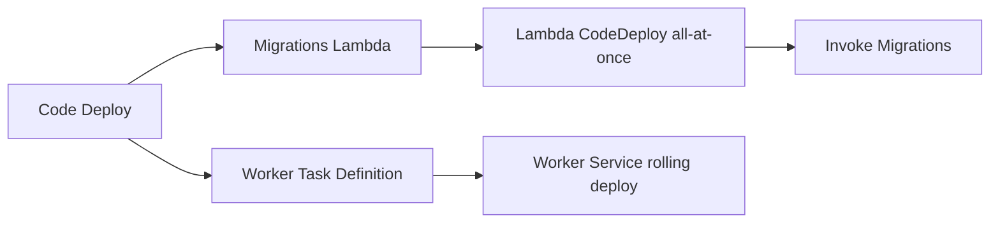

# Infra Notes

Shared infra notes for workflow behavior, saved plans, and Terragrunt graph
debugging.

## Deployment Model

Infrastructure apply and feature-code rollout are intentionally decoupled in
this starter.

- infra workflows create or update infrastructure stacks
- infra workflows create the stable runtime shape, including the Lambda
  CodeDeploy application and deployment group used later for Lambda rollouts
- `*_infra` workflows apply infrastructure only
- build workflows produce Lambda zips and container images
- `*_code` workflows deploy feature code only
- code deploy workflows publish the real Lambda versions and ECS task revisions
  into that pre-created deploy surface
- `*_infra` wrappers need the inputs required to apply infra safely, such as
  graph-derived stack waves and bootstrap references
- in `prod`, the `*_infra` wrappers read shared artifact resources from `ci`
  but only apply service and task stacks in `prod`
- saved `plan` / `apply_plan` artifacts live in GitHub Actions artifacts keyed
  by workflow run id, with one run-level metadata artifact plus one per-stack
  plan artifact
- saved plan artifacts are time-limited; the run-level metadata artifact is
  retained for 14 days, so apply-from-plan must happen before artifact expiry
- each saved-plan stack always uploads `terragrunt.plan.meta.json`; the binary
  `terragrunt.tfplan` and rendered `terragrunt.plan.txt` are uploaded only when
  the plan contains real changes
- Code artifact retention is configured in the shared code bucket module
- rerunning infrastructure apply does not roll out new feature code
- the shared Lambda and ECS module READMEs are the canonical source for
  bootstrap, rollout, and rollback details for each runtime shape
- detailed workflow contracts, reusable-workflow inputs, and repo-local action
  behavior live in [CI docs](../.github/docs/README.md)
- see [Lambda source layout](../lambdas/README.md) and
  [container source layout](../containers/README.md) for runtime source layout,
  build behavior, and boilerplate patterns

Deploy workflows:

- publish Lambda versions and use Lambda CodeDeploy
- invoke the `migrations` Lambda after CodeDeploy completes
- register the `worker` ECS task revision with `worker` and `debug` image URIs
- then use native ECS rolling updates for `service_worker`
- ECS task rollout is not implicitly blocked on Lambda or migration jobs; add
  that ordering only where a caller actually needs it

## Runtime Rollout



## Terragrunt Graph Helpers

Use these commands when debugging stack ordering, workflow wave generation, or
saved-plan metadata joins.

To return the direct dependencies for every module as a JSON object:

```sh
just tg-all-module-dependencies dev
```

To test the wave processor locally through the same split used by CI:

```sh
just tg-graph-waves dev
```

If you only need the raw Terragrunt graph output:

```sh
just tg-graph dev > graph.txt
```

That runs the same non-interactive Terragrunt graph command used in CI:

```sh
cd infra/live/dev/aws
terragrunt run-all graph-dependencies \
  --terragrunt-non-interactive \
  --terragrunt-include-external-dependencies
```

To process that saved graph file into compact dependency JSON:

```sh
just tg-graph-process graph.json dev
```

To return only changed saved-plan items as an object array, set the saved-plan
env vars and run:

```sh
BUCKET_NAME=<code-bucket-name> \
TG_GRAPH_METADATA_PLAN_RUN_ID=<plan-run-id> \
just tg-graph-changed-items graph.json dev
```

To join the processed graph with saved-plan metadata for one plan run, set the
saved-plan env vars before running the processing command:

```sh
BUCKET_NAME=<code-bucket-name> \
TG_GRAPH_METADATA_PLAN_RUN_ID=<plan-run-id> \
just tg-graph-process graph.json dev
```

For a local saved-plan run, pass the Terragrunt operation as one quoted
argument:

```sh
just tg dev aws/oidc 'plan -out=terragrunt.tfplan'
```

The `tg` recipe treats the final argument as the Terragrunt operation string, so
quoting lets you pass flags such as `-out=...` through the wrapper. The workflow
saved-plan path expects the binary plan filename to be `terragrunt.tfplan`.

To apply that same saved plan later, reuse the same run id:

```sh
just tg dev aws/oidc 'apply terragrunt.tfplan'
```
