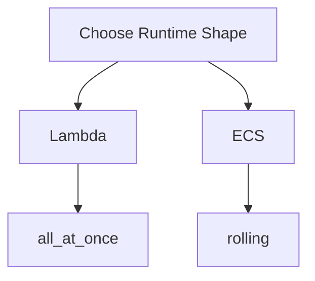

# Deployment Model

Infrastructure apply and feature-code rollout are intentionally decoupled in this boilerplate.

- infra workflows create or update infrastructure stacks
- infra workflows create the stable runtime shape, including the Lambda CodeDeploy application and deployment group used later for Lambda rollouts
- `*_infra` workflows apply infrastructure only
- build workflows produce Lambda zips and container images
- `*_code` workflows deploy feature code only
- code deploy workflows publish the real Lambda versions and ECS task revisions into that pre-created deploy surface
- `*_infra` wrappers need the inputs required to apply infra safely, such as directory-derived stack matrices and any artifact-derived bootstrap references
- in `prod`, the `*_infra` wrappers read shared artifact resources from `ci` but only apply service and task stacks in `prod`
- saved `plan` / `apply_plan` artifacts live in GitHub Actions artifacts keyed by workflow run id, with one run-level metadata artifact plus one per-stack plan artifact
- saved plan artifacts are time-limited; the run-level metadata artifact is retained for 14 days, so apply-from-plan must happen before artifact expiry
- each saved-plan stack always uploads `terragrunt.plan.meta.json`; the binary `terragrunt.tfplan` and rendered `terragrunt.plan.txt` are uploaded only when the plan contains real changes
- Code artifact retention is configured in the shared code bucket module
- rerunning infrastructure apply does not roll out new feature code
- the shared Lambda and ECS module READMEs are the canonical source for bootstrap, rollout, and rollback details for each runtime shape
- detailed workflow contracts, reusable-workflow inputs, repo-local action behavior, and `justfile_path` rules live in [CI docs](../../.github/docs/README.md)
- see [Lambda source layout](../../lambdas/README.md) and [container source layout](../../containers/README.md) for runtime source layout, build behavior, and boilerplate patterns

Deploy workflows:

- publish Lambda versions and use Lambda CodeDeploy
- invoke the `migrations` Lambda after CodeDeploy completes
- register the `worker` ECS task revision with `worker` and `debug` image URIs
- then use native ECS rolling updates for `service_worker`
- ECS task rollout is not implicitly blocked on Lambda or migration jobs; add that ordering only where a caller actually needs it

## Runtime Overview

